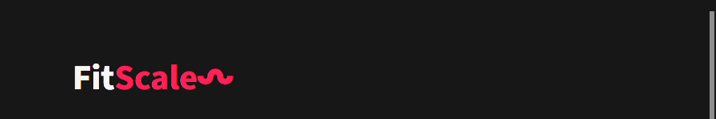
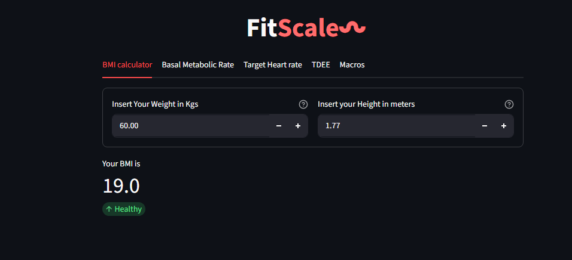
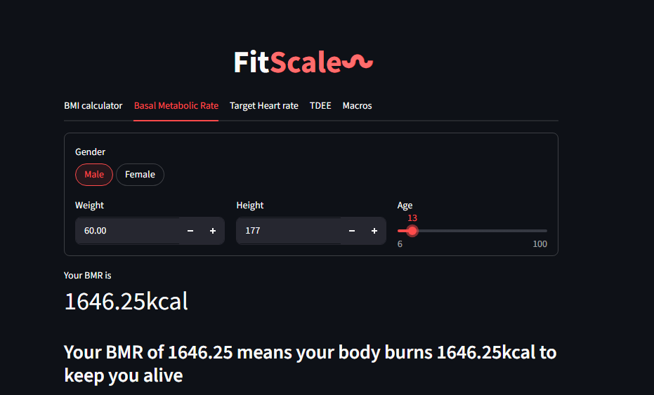
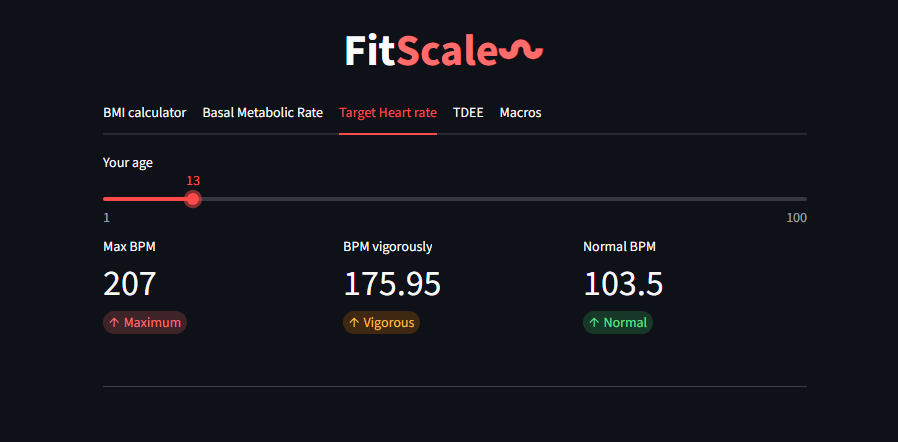
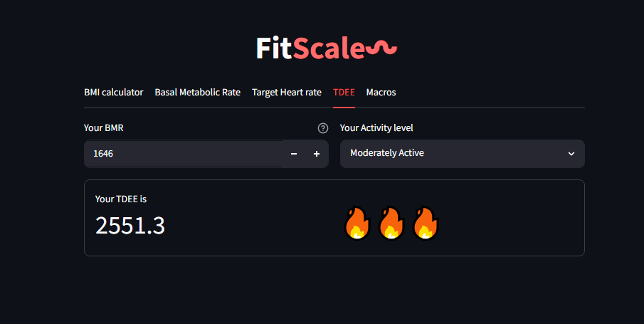
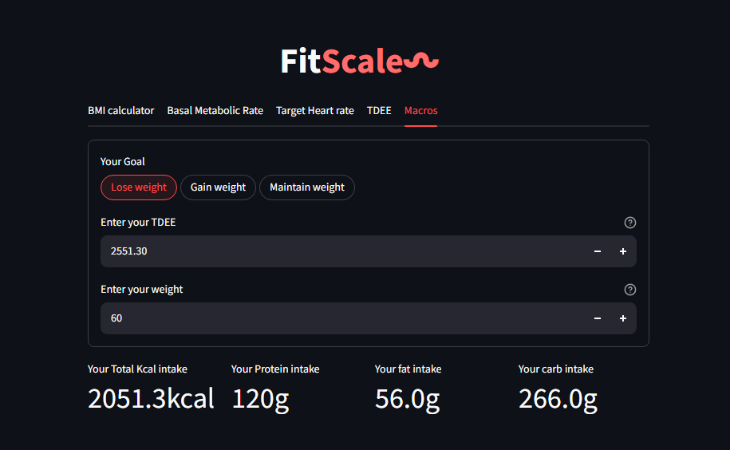

# Fitscale
Fitscale is a **streamlit based health calculator** dedicated to calculate every aspect of 
your health and provide straightforward results. It's ~expensive~ free of cost
it can measure :
| sl.no | features |
| --- | --- |
| 1. | BMI |
| 2. | BMR |
| 3. | TDEE |
| 4. | Target heart rate |
| 5. | Macros |
jump to:
+ [BMI](#bmi-⚖)
+ [BMR](#bmr-💥)
+ [Target heart rate](#target-heart-rate-♥)
+ [TDEE](#tdee-🔥)
+ [Macros](#macros-🍞)
+ [Repo structure](#📂-repo-structure)
# BMI ⚖:

+ enter your weight
+ enter your height in meters
+ get result and also get to know whether you are _emaciated, overweight, obese, underweight or healthy_
# BMR 💥:

+ select your gender
+ enter your weight
+ enter your height
+ enter your age on the slider
+ get the result below
# Target heart rate ♥:

+ enter your age
+ get the result below and find out the max heart rate, heart rate in vigorous activities and normal heart rate
# TDEE 🔥:

+ Enter your BMR
+ Select your activity level
# Macros 🍞:

+ Select whether you want to lose weight, gain weight or maintain it
+ Enter your TDEE and your age

# 📂 Repo structure:
```
Fitscale
|_________ Fitscale
|_________ README
|_________LICENSE
```
# 💻 tech stack
 
# How to run it locally 👨‍💻
1. Move to a folder (e.g- documents)
 ```
    cd documents
 ```  
2. Open your terminal
```
   git clone https://github.com/VX2-sagar-codes/Fitscale-repo
```
3. Navigate through folder
```
  cd fitscale
```
4. Run
```
  streamlit run fitscale.py
```
